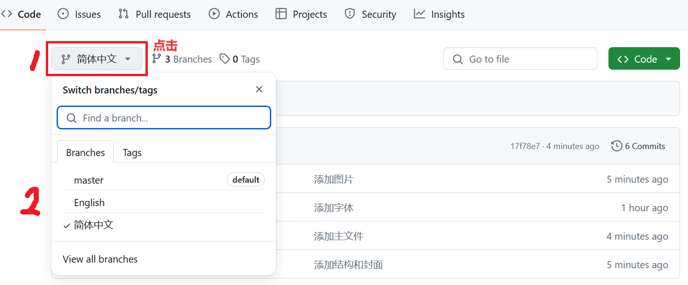

# 吉林大学 Beamer

## 下载
首先根据自己的需求选择不同的模板



### 命令行方式
```bash
$ git branch -r
  origin/English
  origin/HEAD -> origin/master
  origin/master
  origin/简体中文

$ git checkout -b 简体中文    origin/简体中文
正在更新文件: 100% (21/21), 完成.
分支 '简体中文' 设置为跟踪来自 'origin' 的远程分支 '简体中文'。
切换到一个新分支 '简体中文'
```

## 使用
使用```latexmk```编译
```bash
latexmk -f main.tex
```

> [关于Latex Live和Latexmk的配置](https://github.com/IammyselfYBX/.dotfile?tab=readme-ov-file#latex)

## 演示视频
https://github.com/user-attachments/assets/682ef409-7abf-4a6c-be70-e93f8795beea

